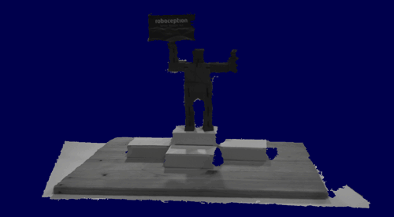

Roboception GenICam 3D Viewer
=============================

This package provides the gc_3dviewer tool for live viewing the 3D data of an
[rc_visard from Roboception GmbH](https://roboception.com/en/rc_visard-en/) via
the GenICam interface.



Usage
-----

gc_3dviewer can be called without any parameters if one rc_visard is the only
GigE Vision device that is connected to the computer. Otherwise, the ID of the
rc_visard must be given to the tool as parameter. The ID can be the serial
number or user defined name of the rc_visard.
See the [rcdiscover tool](https://github.com/roboception/rcdiscover) for getting
this information.

The gc_3dviewer is controlled via key codes. Press `h` to get a list of all
key codes.

Additionally, some GenICam parameter can be changed with the cursor keys. Press
the up and down cursor key to switch between parameter. They will show up in
the lower left corner of the Window. Use the left and right cursor keys to
change values.

Installation
------------

### Windows

A ZIP archive with precompiled binaries is available
(https://github.com/roboception/rc_genicam_3dviewer/releases). Just unpack the
content to any directory and start the gc_3dviewer tool. See usage above!

### Debian/Ubuntu

Precompiled debian packages are available for some Ubuntu distributions.
The packages and their dependencies can be found here:

* https://github.com/roboception/rc_genicam_3dviewer/releases
* https://github.com/roboception/rc_genicam_api/releases
* https://github.com/roboception/cvkit/releases

### Building from source code under Linux

The gc_3dviewer tool is based on [rc_genicam_api](https://github.com/roboception/rc_genicam_api)
and [cvkit](https://github.com/roboception/cvkit).
Both have to be compiled and installed before compiling the rc_genicam_3dviewer package.

Building is done via cmake. Under Linux, the steps are (in the main directory):

```
mkdir build
cd build
cmake ..
make
make install
```

### Building from source under Windows using Visual Studio

It is assumed that Visual Studio is installed.

Compile and install 'cvkit' with GLEW and GLUT as described in the cvkit
package. Compile and install 'rc_genicam_api' in the same way or download
it pre-compiled from github.

NOTE: It is best to install all packages into the same  directory for
resolving dependency at build- and runtime.

Building rc_genicam_3dviewer:

- Start cmake-gui
- Select the rc_genicam_3dviewer source directory as source code path
- Copy the source code path to build the binaries and add /build to the
  path
- Click 'Configure', confirm creating the build directory
- Select the appropriate Visual Studio version (e.g. 'Visual Studio 14
  2015 Win64'), select 'Use default native compilers' and click 'Finish'
- You will get an error because cmake was not able to find cvkit and
  rc_genicam_api
- Search for the key name 'CMAKE_INSTALL_PREFIX' and change the value to
  the install path for cvkit and rc_genicam_api
- Select 'Advanced' and add to CMAKE_EXE_LINKER_FLAGS the directory for
  finding the GLEW and GLUT libs as '/LIBPATH:<alsolute-path-to-lib>'.
- Click 'Configure' again
- Click 'Generate'
- Click 'Open Project'
- In Visual Studio, select 'Release' in the toolbar
- Compile by pressing 'F7'
- In the project view, select INSTALL, open the context menu with the right
  mouse button and select create

License
-------

This package is provided by Roboception GmbH under the 3-clause BSD [license](LICENSE).
